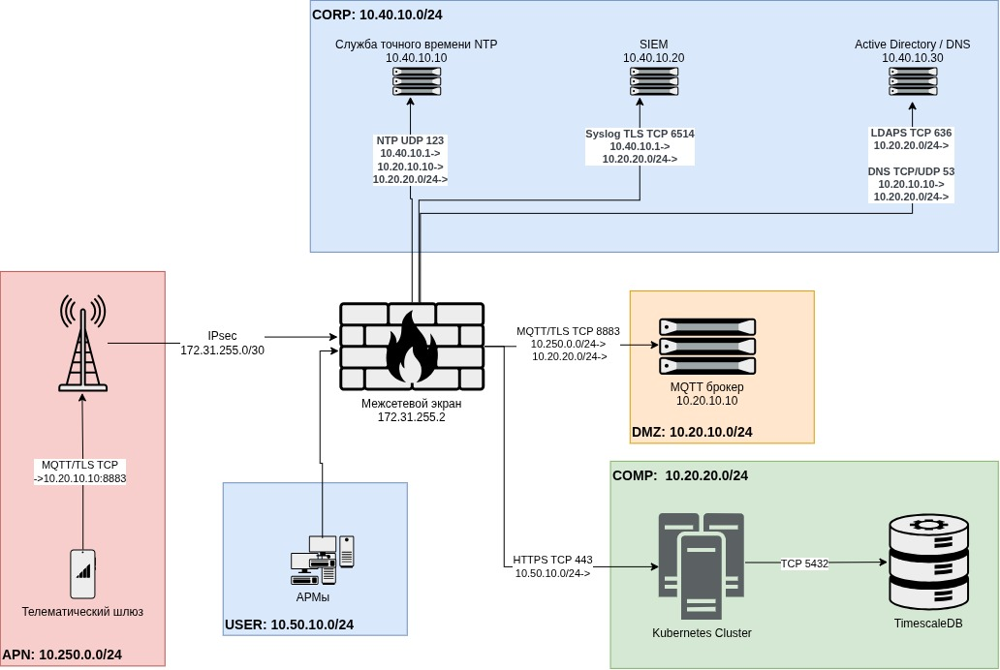

## Сеть

### Схема L3

### Адресный план

| Сегмент / зона | Подсеть |
|---|---|
| Закрытый APN оператора | 10.250.0.0/24 |
| Стык IPsec | 172.31.255.0/30 |
| DMZ | 10.20.10.0/24 |
| Кластер и данные (COMP) | 10.20.20.0/24 |
| Корпоративные сервисы (CORP) | 10.40.10.0/24 |
| Пользователи (USER) | 10.50.10.0/24 |

### Путь трафика телеметрии

Шлюз (10.250.0.x) -> радиосеть оператора / закрытый APN -> IPsec-туннель -> межсетевой экран
(терминация туннеля, фильтрация) -> MQTT-брокер в DMZ (mTLS, ACL по топикам) -> сервис приема в
кластере (подписка на брокера) -> нормализация -> TimescaleDB. 

Путь для пользователя: АРМ (10.50.10.x) -> МЭ -> веб/API в кластере (443) -> данные из TimescaleDB.

### Таблица правил межсетевого экрана

| Источник | Назначение | Проток. | Порт | Обоснование |
|---|---|---|---|---|
| 172.31.255.1 | 172.31.255.2 | UDP | 500, 4500 | Установление IPsec (IKE, NAT-T) |
| 172.31.255.1 | 172.31.255.2 | ESP | - | Полезная нагрузка IPsec |
| 10.250.0.0/24 | 10.20.10.10 | TCP | 8883 | Прием телеметрии, MQTT over TLS, mTLS |
| 10.20.20.0/24 | 10.20.10.10 | TCP | 8883 | Сервис приема подписан на брокера |
| 10.20.20.0/24 | 10.40.10.30 | TCP | 636 | Аутентификация пользователей, LDAPS |
| 10.20.20.0/24 | 10.40.10.30 | UDP/TCP | 53 | Разрешение имен корпоративных сервисов |
| 10.20.20.0/24 | 10.40.10.10 | UDP | 123 | Синхронизация времени узлов |
| 10.20.20.0/24 | 10.40.10.20 | TCP | 6514 | Передача событий ИБ, syslog over TLS |
| 10.20.10.10 | 10.40.10.30 | UDP/TCP | 53 | Разрешение имен корпоративных сервисов брокером |
| 10.20.10.10 | 10.40.10.10 | UDP | 123 | Синхронизация времени узлов брокером |
| 10.50.10.0/24 | VIP веб-интерфейса | TCP | 443 | Доступ к дашборду |

 Сегоменты не пересекаются, NAT не нужен

### Включение AD, SIEM, службы точного времени и рабочих мест

- **Active Directory:** сервисы кластера обращаются к контроллеру домена по LDAPS (636) для проверки
  учетных данных пользователей (правило 7); там же DNS (правило 8).
- **SIEM:** события ИБ приложения уходят по syslog over TLS (6514, правило 10), туда же - логи
  межсетевого экрана (правило 12).
- **Служба точного времени:** узлы кластера синхронизируются по NTP (123, правило 9). Единое время
  критично для корректной метки телеметрии и для сопоставления событий в SIEM. Шлюзы берут время от
  ГНСС с фолбеком на внутренние часы, к корпоративному NTP не обращаются.
- **Рабочие места (АРМ):** пользователи из сети службы главного механика (10.50.10.0/24) заходят на
  дашборд только по HTTPS (443, правило 11), прямого доступа к брокеру, БД или узлам кластера у них нет.

---

### Упрощения и пропуски

1. **Один МЭ на все зоны**
2. **Сегменты управления не показаны**
3. **Отказоустойчивость сети не отражена** 
4. **Адреса и размеры подсетей условны**
5. Только основные правила МЭ 
6. Kubernetes одной нодой
7. Не отражен observability
