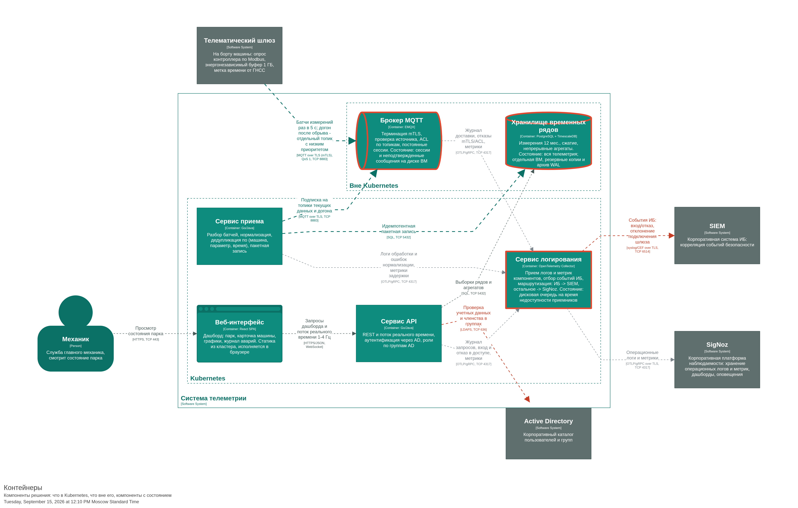

## Архитектура

### Диаграмма компонентов

### Аутентификация и авторизация

- сервис API выполняет LDAP bind от имени пользователя, читает группы и выдает сессионную cookie
- Роль в MVP одна - read-only доступ к дашборду, по группе AD
- Шлюзы аутентифицируются клиентским сертификатом (mTLS); ACL брокера разрешает шлюзу публиковать только в свои топики.

### Компоненты с состоянием

| Компонент | Что хранит | Как обеспечена сохранность |
|---|---|---|
| Буфер шлюза | Данные за период без связи, до 72 ч | Энергонезависимая память 1 ГБ, удаление после PUBACK |
| Брокер MQTT | Неподтвержденные сообщения, сессии | Запись на диск ВМ; при потере диска данные повторно не передаются - риск принят для пилота |
| TimescaleDB | Вся телеметрия 12 мес. | Полная копия раз в неделю, дифференциальная ежедневно, непрерывный архив WAL |
| Сервис логирования | Очередь логов на время недоступности SIEM и SigNoz | Корпоративная зона |

### Жертвы

1. **Отказоустойчивость брокера и СУБД**
2. **ЖЦ сертификатов шлюзов**
3. **CI/CD**
