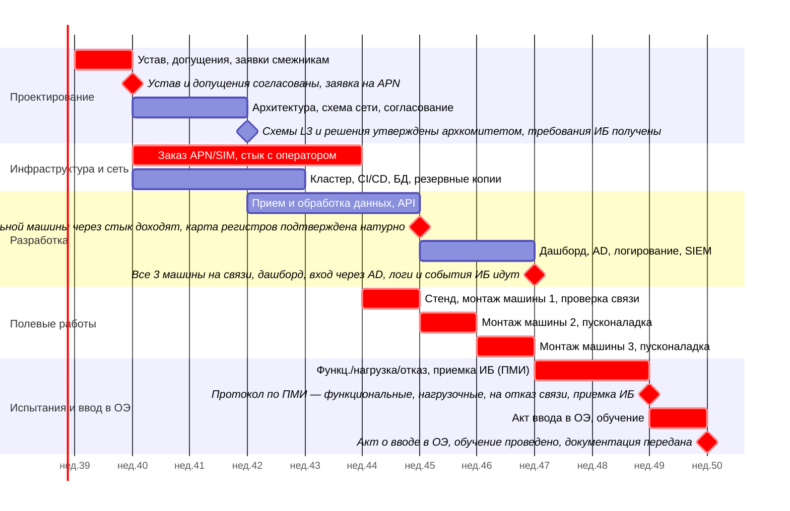
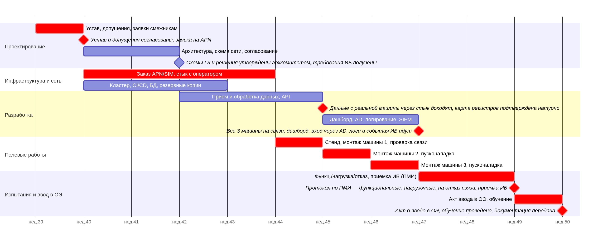

## Дорожная карта

## Риски

| # | Риск (причина -> событие -> последствие) | Вер. | Вл. | Ранг | Владелец |
|---|---|---|---|---|---|
| Р1 | Работы по APN и стыку не укладываются в 6 недель | 4 | 4 | 16 | РП |
| Р2 | Бортовое оборудование не соответствует требованиям | 3 | 5 | 15 | Архитектор |
| Р3 | Карта регистров не соответствует реальной | 4 | 3 | 12 | Инженер АСУ ТП |
| Р4 | Рассогласование окон ТО для монтажа | 3 | 4 | 12 | РП |
| Р5 | Bus-фактор на любой роли | 3 | 4 | 12 | РП |
